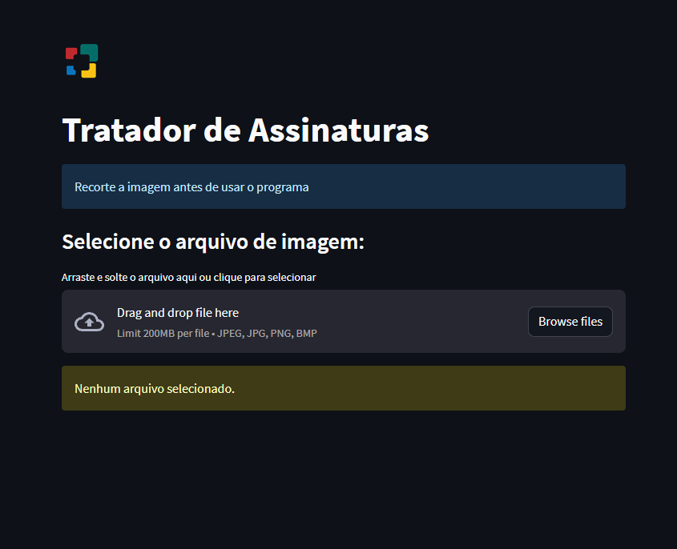
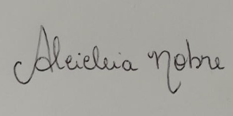

<h1 align="center"> ✒️ Tratador de Assinaturas ✒️ </h1>

Projeto de um programa de tratamento de assinaturas eletrônicas. Nele é possível carregar a imagem, selecionar a pasta de destino e então selecionar o nível de filtro desejado. Ao selecionar o valor, o programa converte a imagem para uma escala cinza, aplica o filtro limiar binário, um filtro de suavização Gaussiano e o de mediana. É possível rodar o programa na web e também através do executável em 'dist/trataimagem.exe'. O link para usar a ferramenta é esse: 
<a align="center" href="https://trataimagem.streamlit.app/">

  <a href="#-tecnologias">Tecnologias</a>

  
  
  
  

 

## 🚀 Tecnologias

Esse projeto foi desenvolvido com Python e suas bibliotecas:

- OpenCV
- Tkinter para a versão executável
- Streamlit para a versão web
- Numpy
- Matplotlib
- OS

por Luan Araujo :wave:
